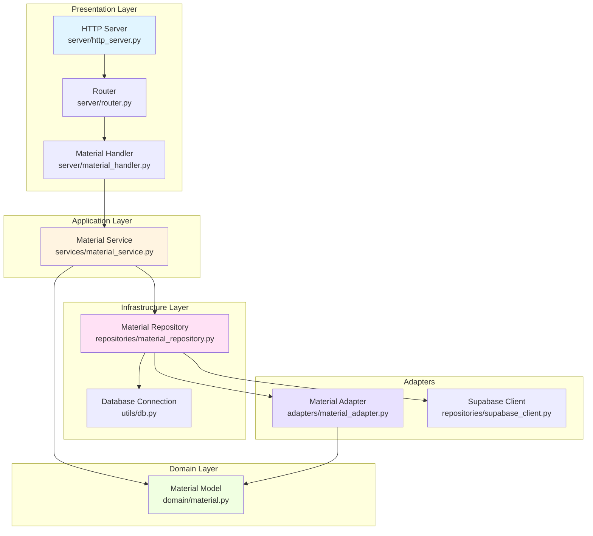
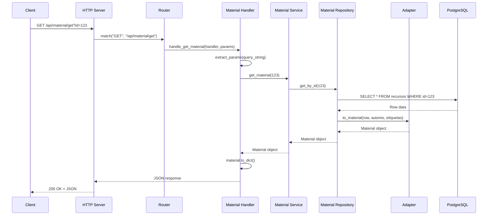
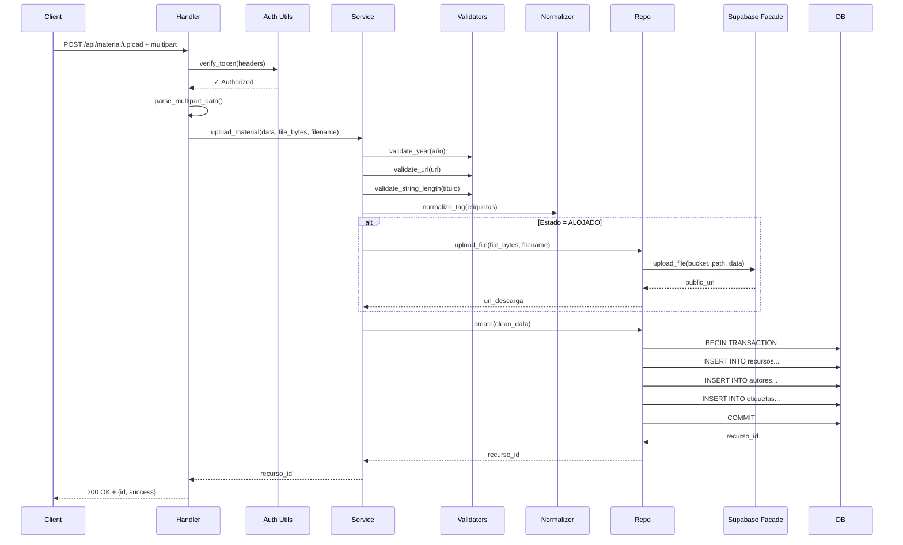

# Arquitectura del Sistema: Repositorio Digital IA y Educación

## Visión General

Este proyecto implementa una **Arquitectura de Monolito Modular en Capas (Layered Modular Monolith)** que separa las responsabilidades del sistema en capas bien definidas, facilitando el mantenimiento, testing y evolución del código.

### Principios Arquitectónicos

1. **Separación de Responsabilidades**: Cada capa tiene un propósito único y bien definido
2. **Dependencias Unidireccionales**: Las capas superiores dependen de las inferiores, nunca al revés
3. **Independencia del Dominio**: La lógica de negocio no depende de detalles técnicos
4. **Testabilidad**: Cada capa puede probarse de forma aislada

## Arquitectura en Capas



## Descripción de Capas

### 1. Presentation Layer (Capa de Presentación)

**Responsabilidad**: Manejar peticiones HTTP y devolver respuestas

**Componentes**:
- `server/http_server.py`: Servidor HTTP base
- `server/router.py`: Sistema de enrutamiento de peticiones
- `server/material_handler.py`: Controladores específicos para materiales

**Qué hace**:
- Recibe peticiones HTTP
- Extrae parámetros (query params, body, headers)
- Llama a la capa de servicios
- Formatea respuestas (JSON, códigos de estado)
- Maneja CORS y headers HTTP

**Qué NO hace**:
- ❌ Validar lógica de negocio
- ❌ Acceder directamente a la base de datos
- ❌ Contener reglas de negocio

### 2. Application Layer (Capa de Aplicación)

**Responsabilidad**: Orquestar la lógica de negocio y casos de uso

**Componentes**:
- `services/material_service.py`: Servicio de materiales

**Qué hace**:
- Valida datos de entrada (reglas de negocio)
- Coordina repositorios y adaptadores
- Implementa flujos de trabajo completos
- Normaliza y transforma datos
- Maneja transacciones de negocio

**Qué NO hace**:
- ❌ Saber sobre HTTP, JSON o peticiones web
- ❌ Acceder directamente a SQL
- ❌ Conocer detalles de Supabase

### 3. Domain Layer (Capa de Dominio)

**Responsabilidad**: Definir modelos de negocio puros

**Componentes**:
- `domain/material.py`: Modelo del dominio Material

**Qué hace**:
- Define la estructura de objetos de negocio
- Contiene métodos de utilidad del dominio
- Es completamente independiente de infraestructura

**Qué NO hace**:
- ❌ Saber cómo se persiste
- ❌ Saber cómo se transmite por HTTP
- ❌ Contener lógica de validación compleja

### 4. Infrastructure Layer (Capa de Infraestructura)

**Responsabilidad**: Gestionar el acceso a datos y recursos externos

**Componentes**:
- `repositories/material_repository.py`: Repositorio de materiales
- `utils/db.py`: Gestor de conexiones a PostgreSQL

**Qué hace**:
- Ejecuta consultas SQL
- Traduce entre SQL y objetos Python
- Maneja transacciones de base de datos
- Gestiona conexiones y pools

**Qué NO hace**:
- ❌ Validar reglas de negocio
- ❌ Saber sobre HTTP
- ❌ Contener lógica de aplicación

### 5. Adapters (Adaptadores)

**Responsabilidad**: Traducir entre sistemas externos y el dominio

**Componentes**:
- `adapters/material_adapter.py`: Adaptador de Material
- `repositories/supabase_client.py`: Facade de Supabase

**Qué hace**:
- Convierte datos de DB a objetos de dominio
- Simplifica APIs complejas
- Desacopla el sistema de dependencias externas

**Qué NO hace**:
- ❌ Contener lógica de negocio
- ❌ Validar datos

## Flujo de una Petición

Veamos cómo fluye una petición GET para obtener un material:



### Explicación Paso a Paso:

1. **Cliente**: Hace una petición HTTP
2. **HTTP Server**: Recibe la petición cruda
3. **Router**: Encuentra el handler correspondiente
4. **Handler**: Extrae parámetros y llama al servicio
5. **Service**: Coordina la operación (en este caso, delega directamente)
6. **Repository**: Ejecuta queries SQL y obtiene datos crudos
7. **Adapter**: Convierte datos crudos a objeto Material
8. **Service**: Retorna el objeto al handler
9. **Handler**: Serializa a JSON y envía respuesta

## Flujo de Creación de un Material

Para operaciones más complejas como la creación:



## Patrones de Diseño Utilizados

### 1. Repository Pattern

**Ubicación**: `repositories/material_repository.py`

**Propósito**: Abstrae el acceso a datos

**Beneficios**:
- El resto del sistema no sabe que usamos PostgreSQL
- Fácil de testear con mocks
- Centraliza todas las queries SQL

### 2. Service Layer Pattern

**Ubicación**: `services/material_service.py`

**Propósito**: Centraliza la lógica de negocio

**Beneficios**:
- Separa validaciones de controladores
- Reutilizable desde diferentes interfaces (HTTP, CLI, etc.)
- Orquesta múltiples repositorios si fuera necesario

### 3. Adapter Pattern

**Ubicación**: `adapters/material_adapter.py`

**Propósito**: Traduce datos de DB a objetos de dominio

**Beneficios**:
- Protege contra cambios en el esquema de DB
- Mantiene el dominio limpio
- Un solo punto de transformación

### 4. Facade Pattern

**Ubicación**: `repositories/supabase_client.py`

**Propósito**: Simplifica la API de Supabase

**Beneficios**:
- Oculta complejidad de configuración
- Desacopla el sistema de Supabase
- Implementa Singleton para reutilizar conexión

### 5. Router Pattern

**Ubicación**: `server/router.py`

**Propósito**: Mapea URLs a handlers

**Beneficios**:
- Centraliza definición de rutas
- Soporta patterns con regex
- Desacopla routing de lógica

### 6. Controller/Handler Pattern

**Ubicación**: `server/material_handler.py`

**Propósito**: Maneja protocolo HTTP

**Beneficios**:
- Separa HTTP de lógica de negocio
- Maneja errores HTTP apropiadamente
- Facilita testing de servicios sin HTTP

### 7. Domain Model Pattern

**Ubicación**: `domain/material.py`

**Propósito**: Define objetos de negocio puros

**Beneficios**:
- No depende de infraestructura
- Type hints para mejor IDE support
- Reutilizable en todo el sistema

## Utilities y Cross-Cutting Concerns

### Validación

**Ubicación**: `utils/validators.py`

- Validaciones reutilizables
- Excepciones personalizadas
- Sanitización de entrada

### Normalización

**Ubicación**: `utils/normalize.py`

- Normalización de etiquetas
- Limpieza de texto

### Autenticación

**Ubicación**: `utils/auth.py`

- Verificación de tokens JWT
- Middleware de autenticación

### Rate Limiting

**Ubicación**: `utils/rate_limiter.py`

- Control de tasa de peticiones
- Prevención de abuso

### Respuestas Estandarizadas

**Ubicación**: `utils/response.py`

- Formato consistente de respuestas
- Manejo de CORS

## Archivos Legacy

El proyecto evolucionó de una arquitectura anterior. Los siguientes archivos están marcados como **LEGACY** y no deben usarse:

| Archivo Legacy | Reemplazo Actual |
|----------------|------------------|
| `api/search.py` | `server/material_handler.py::handle_list_materials` |
| `api/admin/ingestion.py` | `server/material_handler.py::handle_upload_material` |

> ⚠️ **Nota**: Estos archivos se mantienen temporalmente para compatibilidad con el frontend anterior, pero toda nueva funcionalidad debe usar la arquitectura nueva.

## Configuración

**Ubicación**: `config/settings.py`

- Centraliza lectura de variables de entorno
- Usa `python-dotenv` para desarrollo local
- Seguridad: No hardcodea secretos

## Punto de Entrada

**Desarrollo Local**: `app.py`
- Registra todas las rutas
- Inicia el servidor HTTP
- Compatible con Vercel mediante `api/index.py`

## Estructura de Directorios

```
ia_y_educacion/
├── domain/              # Modelos de negocio puros
│   └── material.py
├── services/            # Lógica de aplicación
│   └── material_service.py
├── repositories/        # Acceso a datos
│   ├── material_repository.py
│   └── supabase_client.py
├── adapters/            # Traducción de datos
│   └── material_adapter.py
├── server/              # Capa HTTP
│   ├── http_server.py
│   ├── router.py
│   └── material_handler.py
├── utils/               # Utilidades transversales
│   ├── validators.py
│   ├── normalize.py
│   ├── auth.py
│   ├── db.py
│   ├── rate_limiter.py
│   └── response.py
├── config/              # Configuración
│   └── settings.py
├── api/                 # [LEGACY] Endpoints antiguos
├── static/              # Frontend
└── app.py              # Punto de entrada
```

## Mejores Prácticas

### ✅ Hacer

1. **Respetar las capas**: No saltarse capas (Handler → Service → Repository)
2. **Usar tipos**: Type hints en todas las funciones
3. **Validar en Service**: Todas las validaciones en la capa de servicio
4. **SQL parametrizado**: Siempre usar queries parametrizadas
5. **Documentar patrones**: Mantener comentarios educativos

### ❌ Evitar

1. **No acceder a DB desde Handler**: Siempre pasar por Service
2. **No poner lógica en Repository**: Solo acceso a datos
3. **No hardcodear**: Usar variables de entorno
4. **No mezclar responsabilidades**: Una función, un propósito
5. **No usar archivos legacy**: Usar la arquitectura nueva

## Evolución Futura

Esta arquitectura está preparada para:

- **Agregar nuevos endpoints**: Crear nuevos handlers
- **Agregar nuevas entidades**: Seguir el patrón Domain → Repository → Service → Handler
- **Migrar a microservicios**: Cada capa puede extraerse independientemente
- **Agregar cache**: En la capa de Repository
- **Agregar eventos**: En la capa de Service
- **Cambiar DB**: Solo modificar Repository y Adapter

## Referencias

- [PATRONES_DE_DISEÑO.md](PATRONES_DE_DISEÑO.md) - Guía detallada de cada patrón
- [docs/DATABASE.md](docs/DATABASE.md) - Esquema y optimizaciones
- [docs/DESARROLLO.md](docs/DESARROLLO.md) - Guía para desarrolladores
