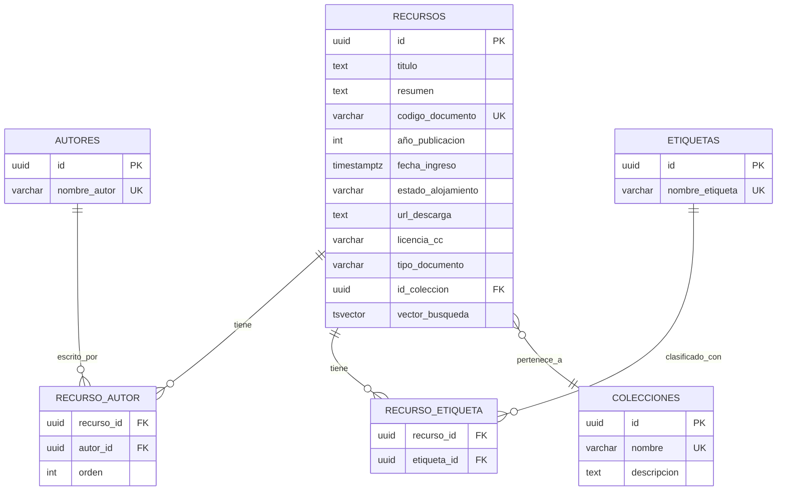
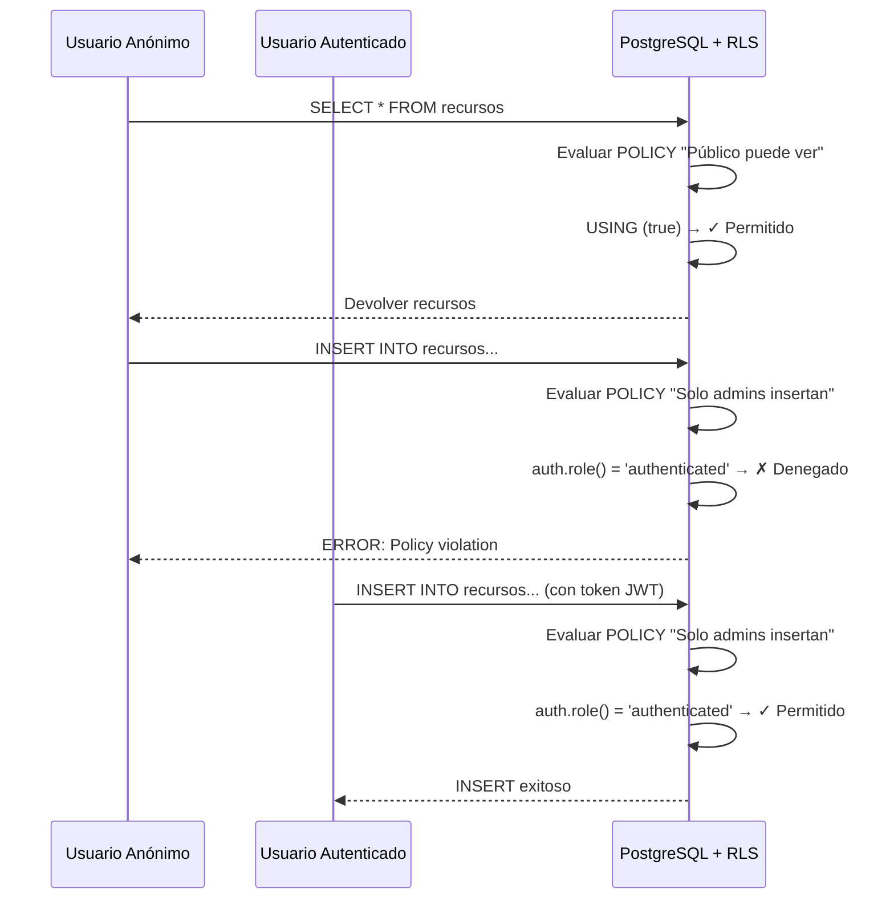

# Base de Datos: Esquema y Optimizaciones

## Visión General

El proyecto utiliza **PostgreSQL 15** (a través de Supabase) con las siguientes características principales:

- **Full-Text Search** en español para búsquedas avanzadas
- **Row Level Security (RLS)** para control de acceso granular
- **Relaciones Many-to-Many** para autores y etiquetas
- **Índices optimizados** para consultas rápidas
- **Funciones almacenadas** para lógica de búsqueda compleja

## Diagrama Entidad-Relación



## Esquema Detallado

### Tabla: `recursos`

Tabla principal que almacena los materiales educativos.

| Columna | Tipo | Restricciones | Descripción |
|---------|------|---------------|-------------|
| `id` | UUID | PK, DEFAULT gen_random_uuid() | Identificador único del recurso |
| `titulo` | TEXT | NOT NULL | Título del documento |
| `resumen` | TEXT | NULLABLE | Abstract o descripción extendida |
| `codigo_documento` | VARCHAR | UNIQUE, NULLABLE | DOI, ISBN u otro identificador |
| `año_publicacion` | INTEGER | NOT NULL, CHECK >= 1900 | Año de publicación |
| `fecha_ingreso` | TIMESTAMPTZ | NOT NULL, DEFAULT NOW() | Fecha de registro en el sistema |
| `estado_alojamiento` | VARCHAR(10) | CHECK IN ('ALOJADO', 'ORIGINAL') | Si el archivo está en Storage o es link externo |
| `url_descarga` | TEXT | NOT NULL | URL pública del documento |
| `licencia_cc` | VARCHAR(50) | NOT NULL | Tipo de licencia Creative Commons |
| `tipo_documento` | VARCHAR(20) | CHECK IN ('ARTICULO', 'TESIS', 'LIBRO', 'INFORME', 'OTRO') | Clasificación del tipo |
| `id_coleccion` | UUID | FK → colecciones.id, NOT NULL | Colección temática |
| `vector_busqueda` | TSVECTOR | GENERATED ALWAYS, STORED | Vector de búsqueda full-text |

**Restricciones importantes:**

```sql
-- Año válido
CHECK (año_publicacion >= 1900 AND año_publicacion <= EXTRACT(year FROM now()))

-- Estado alojamiento
CHECK (estado_alojamiento IN ('ALOJADO', 'ORIGINAL'))

-- Tipo documento
CHECK (tipo_documento IN ('ARTICULO', 'TESIS', 'LIBRO', 'INFORME', 'OTRO'))
```

### Tabla: `autores`

Catálogo de autores (evita duplicados).

| Columna | Tipo | Restricciones | Descripción |
|---------|------|---------------|-------------|
| `id` | UUID | PK | Identificador único |
| `nombre_autor` | VARCHAR | NOT NULL, UNIQUE | Nombre completo del autor |

### Tabla: `colecciones`

Agrupaciones temáticas de recursos.

| Columna | Tipo | Restricciones | Descripción |
|---------|------|---------------|-------------|
| `id` | UUID | PK | Identificador único |
| `nombre` | VARCHAR | NOT NULL, UNIQUE | Nombre de la colección |
| `descripcion` | TEXT | NULLABLE | Descripción opcional |

### Tabla: `etiquetas`

Palabras clave para clasificación.

| Columna | Tipo | Restricciones | Descripción |
|---------|------|---------------|-------------|
| `id` | UUID | PK | Identificador único |
| `nombre_etiqueta` | VARCHAR | NOT NULL, UNIQUE | Etiqueta normalizada |

### Tabla: `recurso_autor` (Relación N:M)

| Columna | Tipo | Restricciones | Descripción |
|---------|------|---------------|-------------|
| `recurso_id` | UUID | FK → recursos.id, ON DELETE CASCADE | ID del recurso |
| `autor_id` | UUID | FK → autores.id, ON DELETE CASCADE | ID del autor |
| `orden` | INTEGER | DEFAULT 1 | Orden de aparición del autor |

**PK Compuesta**: `(recurso_id, autor_id)`

### Tabla: `recurso_etiqueta` (Relación N:M)

| Columna | Tipo | Restricciones | Descripción |
|---------|------|---------------|-------------|
| `recurso_id` | UUID | FK → recursos.id, ON DELETE CASCADE | ID del recurso |
| `etiqueta_id` | UUID | FK → etiquetas.id, ON DELETE CASCADE | ID de la etiqueta |

**PK Compuesta**: `(recurso_id, etiqueta_id)`

## Índices de Rendimiento

Los índices mejoran dramáticamente el rendimiento de búsquedas y filtros.

### Índices Implementados

```sql
-- Índice GIN para full-text search (CRÍTICO para rendimiento)
CREATE INDEX idx_recursos_vector ON recursos USING GIN(vector_busqueda);

-- Índices para filtros comunes
CREATE INDEX idx_recursos_año ON recursos(año_publicacion);
CREATE INDEX idx_recursos_coleccion ON recursos(id_coleccion);
CREATE INDEX idx_recursos_tipo ON recursos(tipo_documento);

-- Índice para búsqueda de autores
CREATE INDEX idx_autores_nombre ON autores(nombre_autor);
```

### Análisis de Rendimiento

| Consulta | Sin Índice | Con Índice | Mejora |
|----------|------------|------------|--------|
| Búsqueda full-text | ~500ms | ~15ms | **33x** |
| Filtro por año | ~200ms | ~5ms | **40x** |
| Filtro por colección | ~150ms | ~3ms | **50x** |

## Full-Text Search (FTS)

### Columna Generada: `vector_busqueda`

Esta columna se calcula automáticamente al insertar/actualizar un recurso:

```sql
ALTER TABLE recursos
ADD COLUMN vector_busqueda TSVECTOR
GENERATED ALWAYS AS (
  -- Peso A (mayor relevancia): Título
  setweight(to_tsvector('spanish', COALESCE(titulo, '')), 'A') ||
  -- Peso B (menor relevancia): Resumen
  setweight(to_tsvector('spanish', COALESCE(resumen, '')), 'B')
) STORED;
```

**¿Por qué pesos diferentes?**
- `'A'`: Coincidencias en el **título** son más relevantes
- `'B'`: Coincidencias en el **resumen** son menos relevantes

Esto afecta el `score` de búsqueda: un documento con la palabra en el título rankeará más alto.

### Función: `buscar_recursos`

Implementa la lógica de búsqueda completa:

```sql
CREATE OR REPLACE FUNCTION buscar_recursos(p_query TEXT)
RETURNS TABLE (
  id UUID,
  titulo TEXT,
  año_publicacion INTEGER,
  score REAL
) AS $$
BEGIN
  -- Caso especial: consulta vacía → devolver todos por fecha de ingreso
  IF p_query IS NULL OR trim(p_query) = '' THEN
    RETURN QUERY
    SELECT
      r.id,
      r.titulo,
      r.año_publicacion,
      0.0::REAL AS score
    FROM recursos r
    ORDER BY r.fecha_ingreso DESC;
  ELSE
    -- Búsqueda normal con full-text search + ILIKE en autores/etiquetas
    RETURN QUERY
    SELECT
      r.id,
      r.titulo,
      r.año_publicacion,
      ts_rank(r.vector_busqueda, plainto_tsquery('spanish', p_query)) AS score
    FROM recursos r
    LEFT JOIN recurso_autor ra ON r.id = ra.recurso_id
    LEFT JOIN autores a ON ra.autor_id = a.id
    LEFT JOIN recurso_etiqueta re ON r.id = re.recurso_id
    LEFT JOIN etiquetas e ON re.etiqueta_id = e.id
    WHERE
      -- Búsqueda en vector (título + resumen)
      r.vector_busqueda @@ plainto_tsquery('spanish', p_query)
      -- O búsqueda en nombre de autor
      OR a.nombre_autor ILIKE '%' || p_query || '%'
      -- O búsqueda en etiquetas
      OR e.nombre_etiqueta ILIKE '%' || p_query || '%'
    GROUP BY r.id
    ORDER BY score DESC;
  END IF;
END;
$$ LANGUAGE plpgsql;
```

**Funcionamiento:**

1. **Entrada vacía**: Devuelve todos los recursos ordenados por fecha de ingreso (más recientes primero)
2. **Con query**: 
   - Busca en `vector_busqueda` (título + resumen) usando `@@` (operador FTS)
   - Busca en nombres de autores con `ILIKE` (case-insensitive)
   - Busca en etiquetas con `ILIKE`
   - Calcula `score` usando `ts_rank` para ordenar por relevancia

### Uso desde Python

```python
# Repository llama a la función
cur.execute("""
    SELECT * FROM buscar_recursos(%s)
""", [query])
```

## Row Level Security (RLS)

RLS permite controlar el acceso a nivel de fila según el usuario autenticado.

### Políticas Implementadas

#### Tabla: `recursos`

```sql
-- Lectura pública (todos pueden ver)
CREATE POLICY "Público puede ver recursos" ON public.recursos
  FOR SELECT
  USING (true);

-- Solo administradores pueden crear
CREATE POLICY "Solo admins insertan recursos" ON public.recursos
  FOR INSERT
  WITH CHECK (auth.role() = 'authenticated');

-- Solo administradores pueden actualizar
CREATE POLICY "Solo admins actualizan recursos" ON public.recursos
  FOR UPDATE
  USING (auth.role() = 'authenticated')
  WITH CHECK (auth.role() = 'authenticated');

-- Solo administradores pueden eliminar
CREATE POLICY "Solo admins eliminan recursos" ON public.recursos
  FOR DELETE
  USING (auth.role() = 'authenticated');
```

#### Tablas de Catálogo (autores, etiquetas, colecciones)

```sql
-- Lectura pública
CREATE POLICY "Público puede ver autores" ON public.autores
  FOR SELECT
  USING (true);

-- Modificación solo para admins
CREATE POLICY "Solo admins modifican autores" ON public.autores
  FOR ALL
  USING (auth.role() = 'authenticated')
  WITH CHECK (auth.role() = 'authenticated');
```

### Cómo Funciona RLS



### Ventajas de RLS

1. **Seguridad en Capa de Datos**: Incluso si hay un bug en la aplicación, la DB protege
2. **Auditoría**: Todas las políticas están en SQL, versionadas
3. **Simplicidad**: No necesitas `WHERE user_id = current_user` en cada query

## Optimizaciones Aplicadas

### 1. Agregación con `json_agg`

En vez de múltiples queries, usamos `json_agg` para traer relaciones en una sola query:

```sql
SELECT 
    r.id, r.titulo,
    -- Traer autores como JSON array en la misma query
    COALESCE(json_agg(DISTINCT a.nombre_autor) 
             FILTER (WHERE a.id IS NOT NULL), '[]') as autores,
    -- Traer etiquetas también
    COALESCE(json_agg(DISTINCT e.nombre_etiqueta) 
             FILTER (WHERE e.id IS NOT NULL), '[]') as etiquetas
FROM recursos r
LEFT JOIN recurso_autor ra ON ra.recurso_id = r.id
LEFT JOIN autores a ON a.id = ra.autor_id
LEFT JOIN recurso_etiqueta re ON re.recurso_id = r.id
LEFT JOIN etiquetas e ON e.id = re.etiqueta_id
GROUP BY r.id
```

**Antes**: 3 queries (recursos + autores + etiquetas)  
**Después**: 1 query

### 2. Queries Parametrizadas

Siempre usamos queries parametrizadas para prevenir SQL Injection:

```python
# ✅ CORRECTO
cur.execute("SELECT * FROM recursos WHERE id = %s", (material_id,))

# ❌ INCORRECTO (Vulnerable a SQL Injection)
cur.execute(f"SELECT * FROM recursos WHERE id = {material_id}")
```

### 3. Transacciones

Usamos context managers para transacciones automáticas:

```python
conn = get_connection()
try:
    with conn:  # Auto-commit/rollback
        with conn.cursor() as cur:
            cur.execute("INSERT INTO recursos ...")
            recurseo_id = cur.fetchone()[0]
            
            cur.execute("INSERT INTO recurso_autor ...")
            # Si algo falla aquí, se hace rollback automático
finally:
    conn.close()
```

## Patrones de Acceso

### Lectura de un Material (con relaciones)

```python
# 1. Query principal
cur.execute("""
    SELECT r.id, r.titulo, ... FROM recursos r
    JOIN colecciones c ON c.id = r.id_coleccion
    WHERE r.id = %s
""", (material_id,))

# 2. Query de autores
cur.execute("""
    SELECT a.nombre_autor FROM recurso_autor ra
    JOIN autores a ON a.id = ra.autor_id
    WHERE ra.recurso_id = %s ORDER BY ra.orden
""", (material_id,))

# 3. Query de etiquetas
cur.execute("""
    SELECT e.nombre_etiqueta FROM recurso_etiqueta re
    JOIN etiquetas e ON e.id = re.etiqueta_id
    WHERE re.recurso_id = %s
""", (material_id,))
```

### Creación de un Material (con transacción)

```python
with conn:
    with conn.cursor() as cur:
        # 1. Insertar recurso principal
        cur.execute("""
            INSERT INTO recursos (...) VALUES (...)
            RETURNING id
        """, (...))
        recurso_id = cur.fetchone()[0]
        
        # 2. Insertar/obtener autores
        for nombre in autores:
            cur.execute("SELECT id FROM autores WHERE nombre_autor=%s", (nombre,))
            row = cur.fetchone()
            if not row:
                cur.execute("INSERT INTO autores (nombre_autor) VALUES (%s) RETURNING id", (nombre,))
                autor_id = cur.fetchone()[0]
            else:
                autor_id = row[0]
            
            # Crear relación
            cur.execute("""
                INSERT INTO recurso_autor (recurso_id, autor_id, orden)
                VALUES (%s, %s, %s) ON CONFLICT DO NOTHING
            """, (recurso_id, autor_id, orden))
        
        # 3. Similar para etiquetas...
```

## Mejores Prácticas

### ✅ Hacer

1. **Usar índices**: Siempre en columnas de filtros frecuentes
2. **Queries parametrizadas**: Previene SQL Injection
3. **EXPLAIN ANALYZE**: Para analizar queries lentas
4. **Transacciones**: Para operaciones multi-tabla
5. **ON DELETE CASCADE**: Para limpiar relaciones automáticamente

### ❌ Evitar

1. **SELECT ***: Especifica solo columnas necesarias
2. **N+1 queries**: Usa `json_agg` o JOINs
3. **LIKE '%...%'**: No usa índices, usa FTS cuando sea posible
4. **Transacciones largas**: Bloquean otras operaciones
5. **Índices en exceso**: Ralentizan INSERTs

## Comandos Útiles

### Conectar a la base de datos

```bash
psql "postgresql://postgres:[PASSWORD]@[HOST]:5432/postgres?sslmode=require"
```

### Analizar rendimiento de una query

```sql
EXPLAIN ANALYZE
SELECT * FROM buscar_recursos('inteligencia artificial');
```

### Ver tamaño de tablas

```sql
SELECT 
    schemaname,
    tablename,
    pg_size_pretty(pg_total_relation_size(schemaname||'.'||tablename)) AS size
FROM pg_tables
WHERE schemaname = 'public'
ORDER BY pg_total_relation_size(schemaname||'.'||tablename) DESC;
```

### Reconstruir índices

```sql
REINDEX INDEX idx_recursos_vector;
```

## Migraciones

Para cambios en el esquema, documentar siempre con:

```sql
-- Migration: YYYY-MM-DD-descripcion.sql
-- Descripción: [Qué cambia y por qué]

BEGIN;

-- Cambios aquí
ALTER TABLE recursos ADD COLUMN nueva_columna TEXT;

COMMIT;
```

## Referencias

- [PostgreSQL Full-Text Search](https://www.postgresql.org/docs/current/textsearch.html)
- [Supabase Row Level Security](https://supabase.com/docs/guides/auth/row-level-security)
- [PostgreSQL Indexes](https://www.postgresql.org/docs/current/indexes.html)
