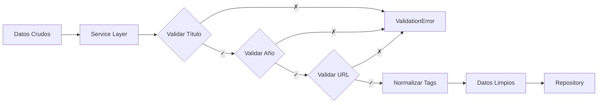

# Patrones de Diseño: Guía Educativa

Este documento explica los patrones de diseño implementados en el proyecto, con ejemplos concretos del código y justificaciones arquitectónicas.

## Índice de Patrones

1. [Repository Pattern](#1-repository-pattern)
2. [Service Layer Pattern](#2-service-layer-pattern)
3. [Adapter Pattern](#3-adapter-pattern)
4. [Facade Pattern](#4-facade-pattern)
5. [Router Pattern](#5-router-pattern)
6. [Controller/Handler Pattern](#6-controllerhandler-pattern)
7. [Domain Model Pattern](#7-domain-model-pattern)

---

## 1. Repository Pattern

### ¿Qué es?

El patrón Repository actúa como una **colección en memoria** de objetos de dominio, ocultando los detalles de acceso a datos (SQL, conexiones, transacciones).

### ¿Por qué lo usamos?

**Problema identificado:**
```python
# ❌ PROBLEMA: Código mezclado (Lógica + SQL)
def get_material_details(material_id):
    conn = psycopg2.connect("postgresql://...")
    cursor = conn.cursor()
    cursor.execute("SELECT * FROM recursos WHERE id=%s", (material_id,))
    row = cursor.fetchone()
    # ... lógica de negocio mezclada con SQL
    conn.close()
    return row
```

**Solución con Repository:**
```python
# ✅ SOLUCIÓN: Separación clara
class MaterialRepository:
    def get_by_id(self, material_id: int) -> Optional[Material]:
        # Todo el SQL vive aquí, encapsulado
        conn = get_connection()
        # ... queries SQL
        return to_material(data, autores, etiquetas)
```

### Beneficios

1. **Abstracción**: El servicio pide objetos, no piensa en tablas
2. **Testabilidad**: Puedes crear un `FakeMaterialRepository` para tests
3. **Centralización**: Todo el SQL en un solo lugar
4. **Flexibilidad**: Cambiar de PostgreSQL a MongoDB solo requiere cambiar el Repository

### Implementación en el Proyecto

**Archivo**: [`repositories/material_repository.py`](file:///c:/Users/Cynthia/OneDrive/Escritorio/EDUCACION/SAIA/ia_y_educacion/repositories/material_repository.py)

**Métodos principales:**

```python
class MaterialRepository:
    def get_by_id(self, material_id: int) -> Optional[Material]:
        """Busca un material por ID"""
        
    def search(self, query: str, filters: Dict, page: int, ...) -> Dict:
        """Búsqueda compleja con filtros dinámicos"""
        
    def create(self, data: Dict[str, Any]) -> int:
        """Inserta un nuevo recurso con sus relaciones"""
        
    def upload_file(self, file_bytes: bytes, filename: str) -> str:
        """Coordina subida de archivos a Storage"""
```

### Ejemplo Real: Búsqueda con Filtros

```python
def search(self, query: str, filters: Dict[str, Any], page: int = 1, 
           per_page: int = 20, order: str = "relevancia"):
    """
    Encapsula la complejidad de:
    - Full-text search en PostgreSQL
    - Filtros dinámicos (autor, año, colección)
    - Paginación
    - Ordenamiento múltiple
    - Joins con tablas relacionadas
    """
    offset = (page - 1) * per_page
    conn = get_connection()
    
    # Construcción dinámica de WHERE clause
    sql_filters = []
    if filters.get("autor"):
        sql_filters.append("EXISTS (SELECT 1 FROM recurso_autor...)")
    
    # El Service no necesita saber estos detalles SQL
    items_sql = f"""
        SELECT sr.id, r.titulo, ...
        FROM buscar_recursos(%s) sr
        WHERE {where_clause}
        ORDER BY {order_sql}
        LIMIT %s OFFSET %s
    """
    return {"total": total, "items": items}
```

### Cuándo Usar

✅ **Úsalo cuando**:
- Necesites acceder a una base de datos
- Quieras abstraer el almacenamiento
- Necesites queries complejas centralizadas

❌ **No lo uses cuando**:
- Solo necesitas leer un archivo de configuración
- Los datos son estáticos (hard-coded)

---

## 2. Service Layer Pattern

### ¿Qué es?

La capa de servicio **orquesta** la lógica de negocio, coordinando repositorios, validaciones y transformaciones.

### ¿Por qué lo usamos?

**Problema identificado:**
```python
# ❌ PROBLEMA: Handler con demasiada responsabilidad
def handle_upload(request):
    # Parser HTTP
    data = parse_multipart(request.body)
    
    # Validaciones (¿aquí?)
    if not data["titulo"]:
        return error("Título requerido")
    
    # Normalización (¿también aquí?)
    tags = [normalize_tag(t) for t in data["etiquetas"]]
    
    # Lógica de archivos (¿mezclado?)
    if data["estado"] == "ALOJADO":
        upload_file(...)
    
    # Acceso a datos (¿directo?)
    cursor.execute("INSERT INTO recursos...")
```

**Solución con Service Layer:**
```python
# ✅ SOLUCIÓN: Responsabilidades separadas
class MaterialService:
    def upload_material(self, data, file_bytes, filename):
        # 1. VALIDACIÓN (Reglas de Negocio)
        titulo = validate_string_length(data.get("titulo"), "Título", 500)
        año = validate_year(int(data.get("año_publicacion")))
        
        # 2. LÓGICA DE ARCHIVOS (Decisión de Negocio)
        if estado == "ALOJADO":
            url = self.repository.upload_file(file_bytes, filename)
        
        # 3. NORMALIZACIÓN (Transformación)
        tags = [normalize_tag(t) for t in data.get("etiquetas")]
        
        # 4. PERSISTENCIA (Delegación)
        return self.repository.create(clean_data)
```

### Beneficios

1. **Reutilización**: El mismo servicio desde HTTP, CLI o cron jobs
2. **Testabilidad**: Tests sin necesidad de servidor HTTP
3. **Lógica Centralizada**: Una fuente de verdad para reglas de negocio
4. **Orquestación**: Coordina múltiples repositorios si es necesario

### Implementación en el Proyecto

**Archivo**: [`services/material_service.py`](file:///c:/Users/Cynthia/OneDrive/Escritorio/EDUCACION/SAIA/ia_y_educacion/services/material_service.py)

**Estructura típica:**

```python
class MaterialService:
    def __init__(self):
        self.repository = MaterialRepository()  # Inyección de dependencias
    
    def upload_material(self, data, file_bytes, filename):
        # PASO 1: VALIDACIÓN
        titulo = validate_string_length(...)
        año = validate_year(...)
        
        # PASO 2: LÓGICA CONDICIONAL
        if estado == "ALOJADO":
            url_descarga = self.repository.upload_file(...)
        
        # PASO 3: NORMALIZACIÓN
        normalized_tags = [normalize_tag(tag) for tag in etiquetas]
        
        # PASO 4: PERSISTENCIA
        return self.repository.create(clean_data)
```

### Flujo de Validación



### Cuándo Usar

✅ **Úsalo cuando**:
- Tienes validaciones complejas
- Necesitas coordinar múltiples repositorios
- Quieres lógica reutilizable desde diferentes interfaces

❌ **No lo uses cuando**:
- Solo necesitas un CRUD simple sin lógica
- No hay validaciones ni transformaciones

---

## 3. Adapter Pattern

### ¿Qué es?

El patrón Adapter **traduce** entre interfaces incompatibles. En nuestro caso, convierte datos de base de datos (dictionaries, tuplas) a objetos de dominio.

### ¿Por qué lo usamos?

**Problema identificado:**
```python
# ❌ PROBLEMA: Acoplamiento a estructura de DB
def get_material(id):
    cursor.execute("SELECT titulo, año_publicacion, resumen FROM recursos...")
    row = cursor.fetchone()
    
    # El código del servicio depende de índices de tupla
    return {
        "title": row[0],      # ¿Qué columna era esta?
        "year": row[1],       # Si cambia el SELECT, esto se rompe
        "summary": row[2]
    }
```

**Solución con Adapter:**
```python
# ✅ SOLUCIÓN: Traducción centralizada
def to_material(row: dict, autores: list, etiquetas: list) -> Material:
    """Convierte datos de DB a objeto de dominio"""
    return Material(
        id=row.get("id"),
        titulo=row.get("titulo"),
        anio_publicacion=row.get("año_publicacion"),
        # ... mapeo completo
        autores=autores,
        etiquetas=etiquetas
    )
```

### Beneficios

1. **Protección**: Si cambia el nombre de columna en DB, solo tocas el adapter
2. **Type Safety**: El dominio usa objetos tipados, no diccionarios crudos
3. **Centralización**: Un solo lugar donde se hace la traducción
4. **Flexibilidad**: Fácil agregar lógica de transformación

### Implementación en el Proyecto

**Archivo**: [`adapters/material_adapter.py`](file:///c:/Users/Cynthia/OneDrive/Escritorio/EDUCACION/SAIA/ia_y_educacion/adapters/material_adapter.py)

```python
    """
    Adapta datos crudos de PostgreSQL al modelo de dominio.
    """
    return Material(
        id=row.get("id"),
        titulo=row.get("titulo"),
        descripcion_resumen=row.get("descripcion_resumen"),
        anio_publicacion=row.get("anio_publicacion"),
        autores=row.get("autores"), # Ahora es un string directo en v2
        institucion_fuente=row.get("institucion_fuente"),
        tipo_recurso=row.get("tipo_recurso"),
        # ... resto de campos v2
        palabras_clave=row.get("palabras_clave")
    )
```

### Uso en Repository

```python
class MaterialRepository:
    def get_by_id(self, material_id: int) -> Optional[Material]:
        # 1. Obtener datos crudos de DB
        cur.execute("SELECT r.id, r.titulo, ... FROM recursos r ...")
        row = cur.fetchone()
        
        # 2. Obtener autores y etiquetas
        autores = [r[0] for r in cur.fetchall()]
        etiquetas = [r[0] for r in cur.fetchall()]
        
        # 3. Usar el Adapter para crear objeto limpio
        return to_material(data, autores, etiquetas)
        #      ↑ Aquí ocurre la "adaptación"
```

### Cuándo Usar

✅ **Úsalo cuando**:
- Necesites convertir entre formatos diferentes (DB ↔ Domain)
- Quieras protegerte de cambios en APIs externas
- Tengas lógica de transformación compleja

❌ **No lo uses cuando**:
- Los datos ya vienen en el formato correcto
- La transformación es trivial (copiar directamente)

---

## 4. Facade Pattern

### ¿Qué es?

El patrón Facade **simplifica** una interfaz compleja proporcionando una API más sencilla y amigable.

### ¿Por qué lo usamos?

**Problema identificado:**
```python
# ❌ PROBLEMA: Complejidad de configuración repetida
from supabase import create_client

# Esto se repetiría en cada archivo que necesite Supabase
url = os.getenv("SUPABASE_URL")
key = os.getenv("SUPABASE_KEY")
supabase = create_client(url, key)

# Y cada archivo tendría que saber cómo subir archivos
result = supabase.storage.from_("mi-bucket").upload(
    path=path,
    file=file_data,
    file_options={"content-type": "application/pdf", "upsert": "false"}
)
```

**Solución con Facade:**
```python
# ✅ SOLUCIÓN: Interfaz simplificada
from repositories.supabase_client import supabase_client

# Simple y directo
url = supabase_client.upload_file("mi-bucket", path, file_data)
```

### Beneficios

1. **Simplicidad**: Métodos simples que ocultan complejidad
2. **Desacoplamiento**: Si cambiamos Supabase por S3, solo tocamos el Facade
3. **Singleton**: Una sola instancia compartida (eficiencia)
4. **Seguridad**: Centraliza manejo de credenciales

### Implementación en el Proyecto

**Archivo**: [`repositories/supabase_client.py`](file:///c:/Users/Cynthia/OneDrive/Escritorio/EDUCACION/SAIA/ia_y_educacion/repositories/supabase_client.py)

```python
class SupabaseClient:
    _instance = None
    
    def __new__(cls):
        # Patrón Singleton: solo una instancia
        if cls._instance is None:
            cls._instance = super(SupabaseClient, cls).__new__(cls)
            # Configuración compleja encapsulada aquí
            cls._instance.client = create_client(SUPABASE_URL, SUPABASE_KEY)
        return cls._instance
    
    def upload_file(self, bucket: str, path: str, file_data: bytes, 
                    content_type: str = "application/pdf"):
        """
        Método simplificado que oculta los detalles de la API de Supabase.
        """
        return self.client.storage.from_(bucket).upload(
            path=path,
            file=file_data,
            file_options={"content-type": content_type, "upsert": "false"}
        )
    
    def get_public_url(self, bucket: str, path: str):
        """Obtiene URL pública sin exponer internals del SDK"""
        return self.client.storage.from_(bucket).get_public_url(path)

# Instancia global lista para usar
supabase_client = SupabaseClient()
```

### Uso en Repository

```python
from repositories.supabase_client import supabase_client

class MaterialRepository:
    def upload_file(self, file_bytes: bytes, filename: str) -> str:
        path = f"uploads/{uuid.uuid4()}_{filename}"
        bucket = "recursos-alojados"
        
        # API simple y clara
        supabase_client.upload_file(bucket, path, file_bytes)
        return supabase_client.get_public_url(bucket, path)
```

### Cuándo Usar

✅ **Úsalo cuando**:
- Una librería externa es muy compleja
- Necesitas configuración repetitiva
- Quieres desacoplar de una dependencia específica
- Necesitas una sola instancia (Singleton)

❌ **No lo uses cuando**:
- La API ya es simple
- No hay configuración compleja

---

## 5. Router Pattern

### ¿Qué es?

El patrón Router **mapea** URLs a funciones handler, permitiendo que el servidor sepa qué código ejecutar para cada petición.

### ¿Por qué lo usamos?

**Problema identificado:**
```python
# ❌ PROBLEMA: Giant if-elif chain
def handle_request(path, method):
    if method == "GET" and path == "/api/material/get":
        handle_get_material()
    elif method == "GET" and path == "/api/material/list":
        handle_list_materials()
    elif method == "POST" and path == "/api/material/upload":
        handle_upload_material()
    # ... 50 rutas más
```

**Solución con Router:**
```python
# ✅ SOLUCIÓN: Registro declarativo de rutas
router = Router()
router.add_route("GET", "/api/material/get", handle_get_material)
router.add_route("GET", "/api/material/list", handle_list_materials)
router.add_route("POST", "/api/material/upload", handle_upload_material)

# Uso simple
handler, params = router.match("GET", "/api/material/get")
```

### Beneficios

1. **Centralización**: Todas las rutas en un solo lugar
2. **Flexibilidad**: Soporte para regex y patterns
3. **Mantenibilidad**: Fácil agregar/modificar rutas
4. **Desacoplamiento**: El servidor no conoce la lógica de cada ruta

### Implementación en el Proyecto

**Archivo**: [`server/router.py`](file:///c:/Users/Cynthia/OneDrive/Escritorio/EDUCACION/SAIA/ia_y_educacion/server/router.py)

```python
import re

class Router:
    def __init__(self):
        self.routes = []
    
    def add_route(self, method, path_pattern, handler):
        """Registra una nueva ruta con soporte para regex"""
        self.routes.append({
            "method": method,
            "pattern": re.compile(f"^{path_pattern}$"),
            "handler": handler
        })
    
    def match(self, method, path):
        """Busca el handler correspondiente a method + path"""
        for route in self.routes:
            if route["method"] == method or route["method"] == "*":
                match = route["pattern"].match(path)
                if match:
                    return route["handler"], match.groupdict()
        return None, None
```

### Uso en app.py

**Archivo**: [`app.py`](file:///c:/Users/Cynthia/OneDrive/Escritorio/EDUCACION/SAIA/ia_y_educacion/app.py)

```python
from server.http_server import RequestHandler
from server.material_handler import (
    handle_get_material, handle_list_materials, handle_upload_material
)

# Registro de rutas (Wiring)
RequestHandler.router.add_route("GET", "/api/material/get", handle_get_material)
RequestHandler.router.add_route("GET", "/api/material/list", handle_list_materials)
RequestHandler.router.add_route("POST", "/api/material/upload", handle_upload_material)

# Rutas con regex para OPTIONS
RequestHandler.router.add_route("OPTIONS", "/api/material/.*", handle_options)
```

### Cuándo Usar

✅ **Úsalo cuando**:
- Tienes múltiples endpoints
- Necesitas routing dinámico
- Quieres separar definición de rutas de lógica

❌ **No lo uses cuando**:
- Tienes un solo endpoint
- El routing es trivial

---

## 6. Controller/Handler Pattern

### ¿Qué es?

El patrón Controller/Handler maneja el **protocolo de comunicación** (HTTP) y traduce peticiones a llamadas al servicio.

### ¿Por qué lo usamos?

**Problema identificado:**
```python
# ❌ PROBLEMA: Servicio acoplado a HTTP
class MaterialService:
    def get_material(self, request):  # ← ¿Por qué conoce request?
        material_id = request.query_params.get("id")  # ← HTTP details
        # ... lógica de negocio
        return JsonResponse(material.to_dict())  # ← HTTP response
```

**Solución con Handler:**
```python
# ✅ SOLUCIÓN: Responsabilidades separadas

# Handler: Maneja HTTP
def handle_get_material(handler, params):
    # 1. Extraer parámetros HTTP
    material_id = extract_id_from_query(handler.path)
    
    # 2. Llamar al servicio (sin HTTP)
    material = material_service.get_material(int(material_id))
    
    # 3. Formatear respuesta HTTP
    Response.json(handler, material.to_dict())

# Service: Lógica pura
class MaterialService:
    def get_material(self, material_id: int) -> Material:
        # Sin referencias a HTTP
        return self.repository.get_by_id(material_id)
```

### Beneficios

1. **Separación de Protocolo**: El servicio no sabe de HTTP
2. **Reutilización**: El mismo servicio desde CLI, gRPC, etc.
3. **Testabilidad**: Tests de servicio sin servidor HTTP
4. **Manejo de Errores**: Traduce excepciones a códigos HTTP apropiados

### Implementación en el Proyecto

**Archivo**: [`server/material_handler.py`](file:///c:/Users/Cynthia/OneDrive/Escritorio/EDUCACION/SAIA/ia_y_educacion/server/material_handler.py)

```python
from services.material_service import MaterialService
from utils.response import Response

material_service = MaterialService()

def handle_get_material(handler, params):
    """Maneja GET /api/material/get?id=..."""
    
    # PASO 1: Parsing HTTP
    query_string = handler.path.split('?', 1)[1] if '?' in handler.path else ''
    qs = parse_qs(query_string)
    material_id = qs.get("id", [None])[0]
    
    # PASO 2: Validación HTTP
    if not material_id:
        Response.error(handler, "Missing id parameter", 400)
        return
    
    try:
        # PASO 3: Llamada al Servicio (sin HTTP)
        material = material_service.get_material(int(material_id))
        
        # PASO 4: Formateo de Respuesta HTTP
        if material:
            Response.json(handler, material.to_dict())
        else:
            Response.error(handler, "Material not found", 404)
    except Exception as e:
        Response.error(handler, str(e), 500)
```

### Traducción de Errores

```python
def handle_upload_material(handler, params):
    try:
        recurso_id = material_service.upload_material(data, file_bytes, filename)
        Response.json(handler, {"id": str(recurso_id), "success": True})
    except ValidationError as e:
        Response.error(handler, str(e), 400)  # ← Bad Request
    except PermissionError as e:
        Response.error(handler, str(e), 403)  # ← Forbidden
    except Exception as e:
        Response.error(handler, str(e), 500)  # ← Internal Server Error
```

### Cuándo Usar

✅ **Úsalo cuando**:
- Tienes una API HTTP/REST
- Quieres separar protocolo de lógica
- Necesitas diferentes interfaces (HTTP, CLI, etc.)

❌ **No lo uses cuando**:
- Tu aplicación no tiene interfaz de comunicación
- La lógica es muy simple (CRUD básico)

---

## 7. Domain Model Pattern

### ¿Qué es?

El patrón Domain Model define objetos de negocio **puros** que representan conceptos del dominio, sin dependencias de infraestructura.

### ¿Por qué lo usamos?

**Problema identificado:**
```python
# ❌ PROBLEMA: Diccionarios sin tipo
def process_material(material):
    # ¿Qué campos tiene material?
    # ¿Es material["titulo"] o material["title"]?
    # El IDE no puede ayudarnos
    print(material["titulo"])  # ← Propenso a typos
```

**Solución con Domain Model:**
```python
# ✅ SOLUCIÓN: Clase tipada
@dataclass
class Material:
    titulo: str
    resumen: Optional[str]
    anio_publicacion: int
    # ...

def process_material(material: Material):
    print(material.titulo)  # ← Autocompletado, type checking
```

### Beneficios

1. **Type Safety**: El IDE detecta errores antes de ejecutar
2. **Documentación**: La clase ES la documentación del modelo
3. **Independencia**: No depende de DB, HTTP o frameworks
4. **Reusabilidad**: Se usa en toda la aplicación

### Implementación en el Proyecto

**Archivo**: [`domain/material.py`](file:///c:/Users/Cynthia/OneDrive/Escritorio/EDUCACION/SAIA/ia_y_educacion/domain/material.py)

```python
from dataclasses import dataclass
from typing import List, Optional

@dataclass
class Material:
    """
    Modelo de dominio que representa un recurso digital.
    
    Este objeto es PURO: no sabe cómo se guarda en DB,
    no sabe cómo se transmite por HTTP, solo representa
    el concepto de negocio "Material".
    """
    id: int
    titulo: str
    resumen: Optional[str]
    anio_publicacion: Optional[int]
    fecha_ingreso: Optional[str]
    estado_alojamiento: str
    url_descarga: Optional[str]
    licencia_cc: str
    tipo_documento: str
    codigo_documento: Optional[str]
    coleccion: str
    autores: List[str]
    etiquetas: List[str]
    
    def to_dict(self):
        """Helper para serialización a JSON"""
        return {
            "id": self.id,
            "titulo": self.titulo,
            "año_publicacion": self.anio_publicacion,
            # ... resto de campos
        }
```

### Uso en toda la aplicación

```python
# En Repository: creación de objetos
def get_by_id(self, material_id: int) -> Optional[Material]:
    # ...
    return to_material(data, autores, etiquetas)

# En Service: manipulación de objetos
def get_material(self, material_id: int) -> Material:
    material = self.repository.get_by_id(material_id)
    # Podemos acceder a material.titulo, material.autores, etc.
    return material

# En Handler: serialización a JSON
def handle_get_material(handler, params):
    material = material_service.get_material(id)
    Response.json(handler, material.to_dict())
```

### Cuándo Usar

✅ **Úsalo cuando**:
- Tienes entidades de negocio complejas
- Quieres type safety
- Necesitas reutilizar el modelo en múltiples capas

❌ **No lo uses cuando**:
- Los datos son muy simples (un solo campo)
- Solo necesitas pasar datos sin lógica

---

## Resumen de Patrones

| Patrón | Archivo | Propósito | Cuándo Usar |
|--------|---------|-----------|-------------|
| **Repository** | `repositories/material_repository.py` | Abstrae acceso a datos | Siempre que accedas a DB |
| **Service Layer** | `services/material_service.py` | Centraliza lógica de negocio | Para validaciones y orquestación |
| **Adapter** | `adapters/material_adapter.py` | Traduce entre capas | Para convertir DB ↔ Domain |
| **Facade** | `repositories/supabase_client.py` | Simplifica APIs complejas | Para librerías externas complejas |
| **Router** | `server/router.py` | Mapea URLs a handlers | Para múltiples endpoints |
| **Controller** | `server/material_handler.py` | Maneja protocolo HTTP | Para separar HTTP de lógica |
| **Domain Model** | `domain/material.py` | Define objetos de negocio | Para entidades principales |

## Próximos Pasos

- Leer [ARQUITECTURA.md](ARQUITECTURA.md) para ver cómo estos patrones se integran
- Consultar [docs/DESARROLLO.md](docs/DESARROLLO.md) para aprender a extender el sistema
- Revisar el código fuente con estos patrones en mente

## Referencias

- [Martin Fowler - Patterns of Enterprise Application Architecture](https://martinfowler.com/eaaCatalog/)
- [Repository Pattern](https://martinfowler.com/eaaCatalog/repository.html)
- [Service Layer Pattern](https://martinfowler.com/eaaCatalog/serviceLayer.html)
- [Domain Model Pattern](https://martinfowler.com/eaaCatalog/domainModel.html)
